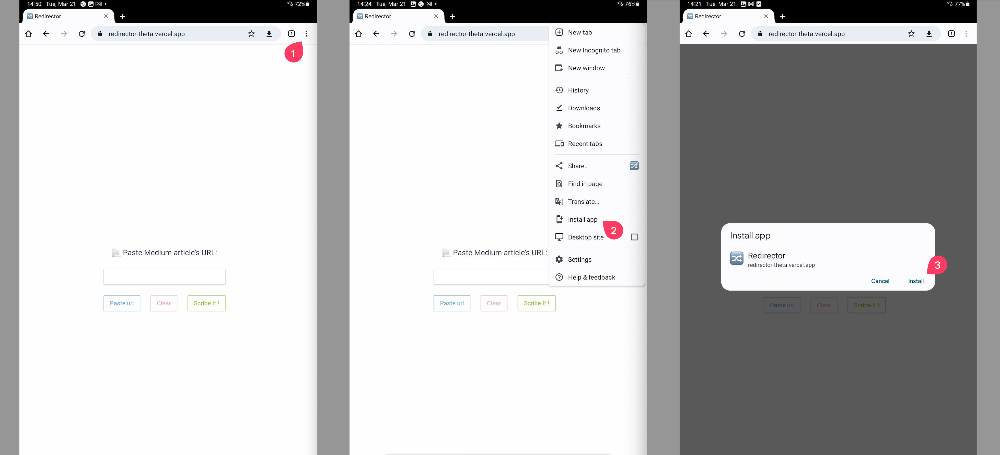

# Redirector

> **Redirector** is an App that simply let you read medium paid articles for free.

## How

The app is based on that project ( [link](https://scribe.rip/) ) and adds value to it providing a more friendly interface and kind of automation to the process...

## Two ways :

- Simply open the app, and paste an article link you've already copied

- Use the native share functionality of your device (browser, medium app, etc..) to send the link directly to the App.
  (This feature is currently not available for IOS devices)

## The App

You can use it online straight from the site : [Redirector](https://scribe.rip/)

// todo : Add image when logo has been added

Or you can install the PWA :

### Installation

The browser is supposed to suggest installing the PWA application.

	

If you dont see the prompt 'Add to Home screen', then follow the instructions :

1. ### Android devices :

2. ### Ios devices :

   Warning : you can Only install pwa from safari browser.
	 

   

